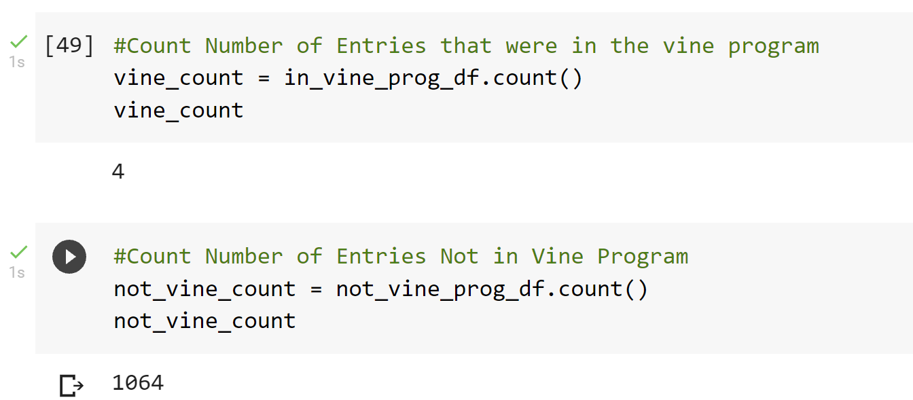
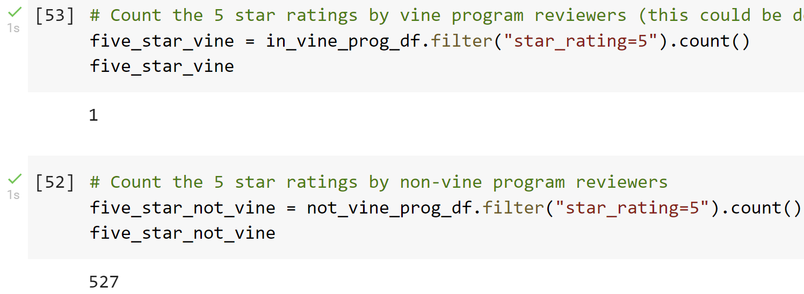
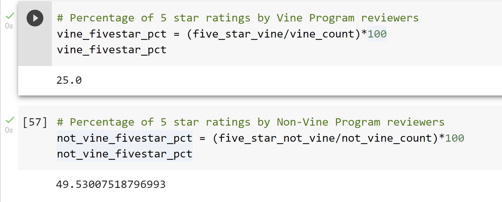

# Amazon_Vine_Analysis
## Overview of Analysis
- The purpose of the analysis was to learn more about the Amazon Vine review program. Amazon is paid by a company to provide their products to Amazon Vine members, who are then required to publish a review for said product. We wanted to gauge the efficacy of the reviews produced by this program. This analysis was based on a dataset made up of "Mobile Electronics". There are many other datasets are available, so the same process could be used on the other datasets.
## Results
### How many Vine reviews and non-Vine reviews were there?
- Total Vine Reviews: 4
- Total Non-Vine Reviews: 1064

### How many Vine reviews were 5 stars? How many non-Vine reviews were 5 stars?
- Total 5-Star Ratings By Vine Users: 1
- Total 5-Star Ratings by Non-Vine Users: 527

### What percentage of Vine reviews were 5 stars? What percentage of non-Vine reviews were 5 stars?
- Percentage 5-Star Ratings by Vine Users: 25%
- Percentage 5-Star Ratings by Non-Vine Users: 49.53%

## Summary
- Given our current information, there is no positivity bias by the Vine Users. In fact, their reviews are less likely to be five-star ratings. It must be noted that the vine reviewers group was tiny sample size, which could skew our results. It would be best to run the same analysis on additional datasets to confirm the results. We also could analyze the propensity of each group for posting single star ratings. 

- If we assume the results of future analyses match the findings of this analysis, and that analysis of 1-Star ratings discovers non-vine users give 1-Star ratings more frequently as well, we might make some conclusions. We might assume that non-vine users typically publish reviews on polarizing products and are less likely to post a review if the product is neither great nor horrible. While, the vine users are required to post on all products, regardless of their opinion of them.
